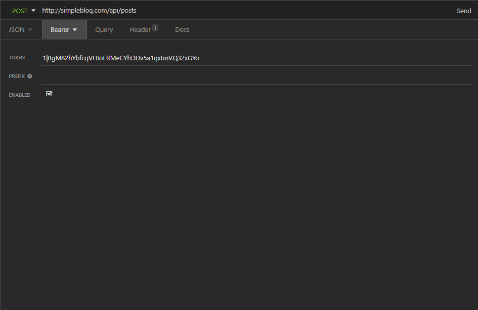
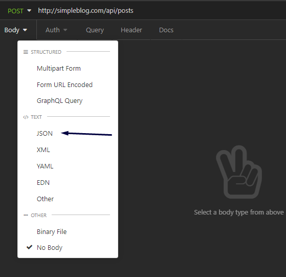
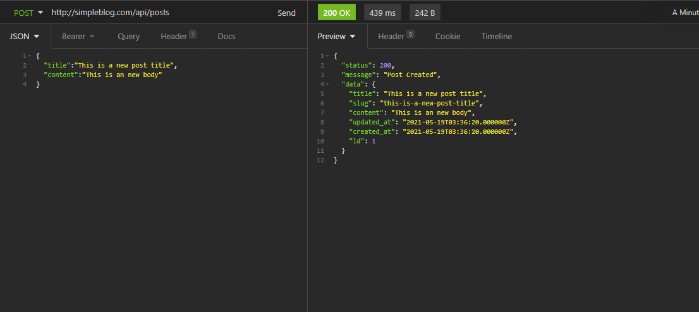
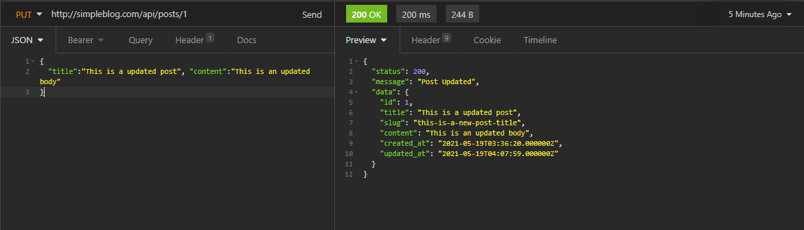
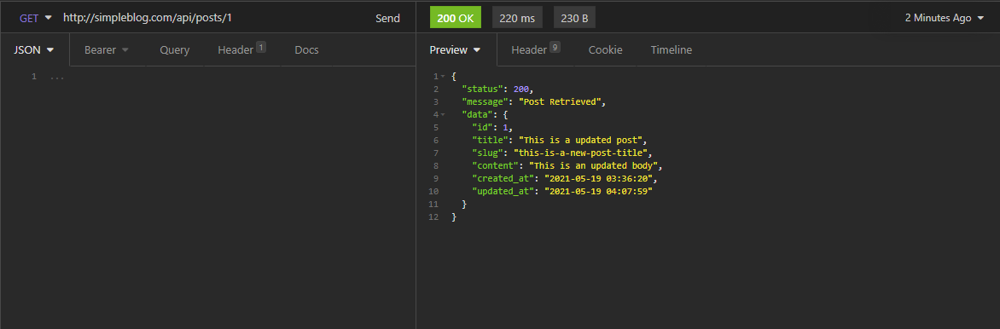
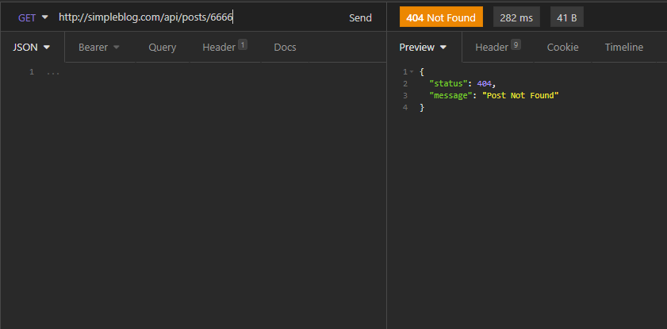
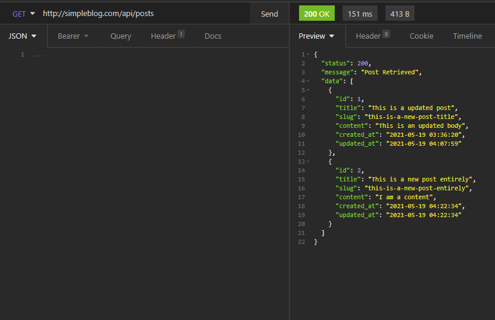
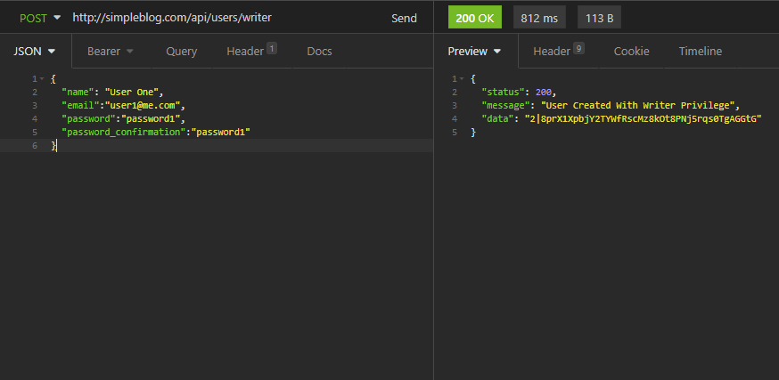
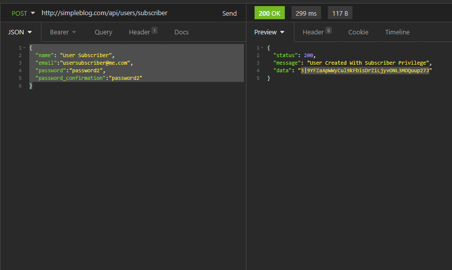

<a>REST API with Roles and Permissions</a>

## CREATING A NEW MESSAGE

    POST /api/posts
    {
        "title":"This is a new post title",
        "content":"This is an new body
    }

## MESSAGE UPDATE

    PUT /api/posts/1
    {
        "title":"This is a new post title",
        "content":"This is an new body
    }

## RECEIVING A MESSAGE

    GET /api/posts/1

## RECEIVING All MESSAGES

    GET /api/posts

## CREATING A NEW USER WITH  WRITER  PERMISSION

    POST /api/users/writter
    {
    "name": "First One",
    "email":"user1@email.com",
    "password":"password1",
    "password_confirmation":"password1"
    }

## CREATING A NEW SUBSCRIBER USER

    POST /api/users/subscriber
    {
    "name": "User Subscriber",
    "email":"usersubscriber@me.com",
    "password":"password2",
    "password_confirmation":"password2"
     } 

